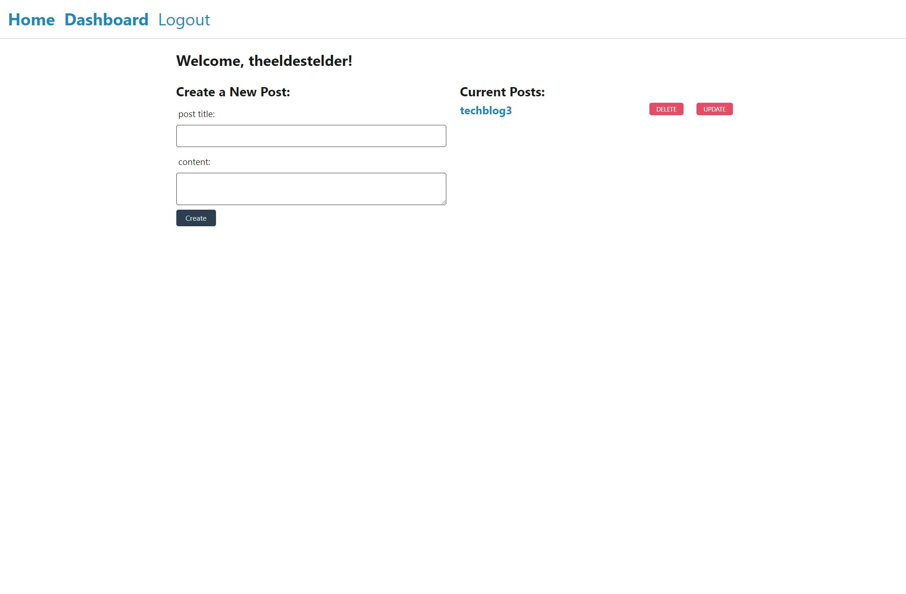

# Tech-Blog

## Description
This is a fullstack app developed in node.js that uses express.js with sequelize to handle back end database management, handlebars to display front end, and the MVC project structure to create a blog like webpage where users can sign up and add, update, and delete blog posts that they post to the website. Users can also go and comment on other users posts.

 

## Images

**Above is an image of the webpage upon launching it**

 

**Above is an image of the login/signup section of the webpage**

 

**Above is an image of a user's dashboard where their old posts can be seen and where they can create new posts**

 

**Above is an image showing what the user will see if they would like to update an old post with new info**

 

## Installation and Operation
In order to run this app, the user must first clone the repo locally and then navigate into the cloned repo. Once in the cloned repo, run `npm install`. The user should have mySQL workbench installed and should open and run the schema.sql file found in the db folder in mySQL workbench before running the app. The next step that the user will need to do is create a .env file in their local repo. An example of what this file looks like is supplied in the .env.EXAMPLE file. The user can then seed the database by running `node seeds/seed.js`. After the previous steps have been completed, then the server can be started using `node server.js`. From there the user can access the webpage by going into their browser of choice and navigate to `localhost:3001`. For simplicity, the user can also access a fully working version of this app through the deployment link below.

 

## Deployment Link
https://shielded-tor-32989.herokuapp.com/